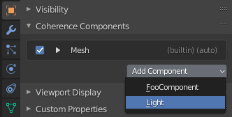

Writing Components
===================

Third party developers can create **Coherence Components** - as Python classes or Unity MonoBehaviours - that are added and removed from :class:`bpy.types.Object` instances in the scene.

A third party component attached to an object can listen to Coherence events (enabled, connected, etc), share properties, and send or receive custom events between applications.

.. tip::
    All components on the same :class:`bpy.types.Object` share the same synced GameObject, so you can essentially think of each Coherence Component as our Blender-equivalent to MonoBehaviours.

Creating Blender Components
----------------------------

Blender is used for the "source of truth" of which objects in the scene should sync with Unity. Only objects with one or more components are synced to Unity.

An object can have multiple components attached to it, but it cannot contain duplicates of the same component.

To add your own component start by creating a Blender addon that registers a new component class with the Coherence API within Blender's ``register`` method:

.. code-block:: python

    bl_info = {
        'name': 'My Coherence Plugin',
        # ... your other addon settings ...
    }

    import bpy
    import Coherence

    class Light(Coherence.api.Component):
        def on_create(self):
            print('Added Light Component!')

        def on_destroy(self):
            print('Removed Light Component!')

    def register():
        Coherence.api.register_component(Light)

    def unregister():
        Coherence.api.unregister_component(Light)

The class name ``Light`` is our common component name shared between applications and must be unique across all third party plugins registered with Coherence.

After the component has been registered you can use the Object's *Coherence Components* panel to add your component to an object by clicking the *Add Component* button.

.. important::
    You can only attach a single instance of a component per object.

You can also add a component to an object through the Coherence API.

.. code-block:: python

    sun = bpy.data.objects['Sun']
    Coherence.api.add_component(sun, Light)

If this is the first component attached to the object then Coherence will start syncing the object's transformation with Unity as a new :sphinxsharp:type:`UnityEngine.GameObject`.

Creating Unity Components
--------------------------

After a component has been attached to an object in Blender a linked :sphinxsharp:type:`UnityEngine.MonoBehaviour` can be automatically added to the matching GameObject.

Add a new MonoBehaviour to your Unity project:

.. code-block:: C#

    using UnityEngine;
    using Coherence;

    [ExecuteAlways]
    [Component("Light")]
    public class BlenderLight : MonoBehaviour, IComponent
    {
        private void OnEnable()
        {
            Debug.Log("Added Light Component!");
        }

        private void OnDisable()
        {
            Debug.Log("Removed Light Component!");
        }
    }

The :sphinxsharp:type:`ComponentAttribute` of your MonoBehaviour must match the name of the component class in Blender (``Light`` in the prior example).

To make sure the component works in edit mode you will also need to add Unity's `[ExecuteAlways] <https://docs.unity3d.com/ScriptReference/ExecuteAlways.html>`_ attribute.

By adding the :sphinxsharp:type:`IComponent` interface to the MonoBehaviour your component can now access additional Coherence API features through added extension methods.

After recompiling assemblies register your component with Coherence by selecting it in the **Register Component** button menu in Unity's Coherence Settings window.

Once you have added both synced components you can start using the Component API to share events and data between applications.

Removing Components
--------------------

Calling :meth:`.Component.destroy` or :func:`destroy_component` from Blender will remove **both** the Blender Component and the linked Unity MonoBehaviour.

.. code-block:: python

    sun = bpy.data.objects['Sun']
    Coherence.api.destroy_component(sun, Light)

Like Unity, both :meth:`.Component.on_disable` and :meth:`.Component.on_destroy` will be called when removed.

.. important::
    If an object has no components remaining, it will no longer be synced and the linked :sphinxsharp:type:`UnityEngine.GameObject` will be destroyed.

Automatic Binding
------------------

Components can be written to automatically add themselves to objects in your scene instead of manually through the Blender UI or API.

Declare a ``poll`` class method in your component that accepts a :class:`bpy.types.Object`. Whenever Coherence checks for new objects in the scene, your component's ``poll`` will be executed against each object to determine if Coherence should automatically add it as a new component.

.. code-block:: python

    class Light(Coherence.api.Component):
        @classmethod
        def poll(cls, obj):
            """Test if this component should automatically bind to an object

            Args:
                obj (bpy.types.Object)

            Returns:
                bool
            """
            # Automatically add this component to all LIGHT objects
            return obj.type == 'LIGHT'

        # ... rest of your component ...
