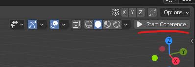
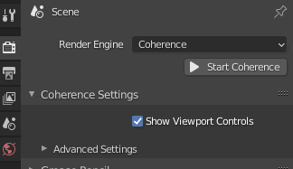
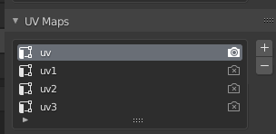

Basic Usage
============

Starting Coherence
--------------------

After installing into both Unity and Blender, you will need to "start" both ends to open a channel for communication.

In Unity - this is done by clicking the *Start* button in the Coherence Settings window.

.. image:: https://i.imgur.com/iuSVJpE.png
    :alt: Start Coherence in Unity

In Blender - click the *Start Coherence* button in the top right of your viewport:

This will activate the Coherence render engine and switch your viewport to the render preview mode. Once Blender syncs with Unity you should see the Unity scene, including your objects, synced up within the Blender viewport:

.. image:: https://i.imgur.com/78fkHIA.png
    :alt: Blender Viewport Render

To make adjustments to addon settings - go to the *Render Properties* panel:

.. note::
    Since Coherence is a render engine (similar to Cycles) you will only see the Unity view when in either Material Preview or Render Preview mode. You can switch between Viewport Shading and the Unity view at any time.

Navigating the Scene
----------------------

A Unity camera will track the Blender viewport camera as you navigate around in Blender - allowing the rendered view from Unity to always stay synced with your objects in Blender.

This supports both perspective and orthographic viewports.

Modeling and Sculpting
------------------------

Objects in your scene that can be converted to meshes are automatically synced with Unity as you make changes to the mesh This supports sculpting tools, modifiers, and instancing.

The list of supported objects include:

* Meshes
* Text
* Metaballs
* Curves with mesh modifiers

**Dyntopo** must be turned off when sculpting - otherwise the wrong mesh data may be synced with Unity.

.. important::
    Mesh data - including transforms, vertices, UVs, and vertex colors - are all one-way from Blender to Unity. Making changes in Unity will not be reflected back in Blender.

Editing UVs
------------

Up to **four** UV layers on a mesh will sync with Unity as you make changes. The ordering of UV layers in the object's *UV Maps* panel determine the UV inputs on the Unity Mesh:

Editing Vertex Colors
----------------------

Only the active vertex color layer in the object's *Vertex Colors* panel will sync with Unity as you make changes.

