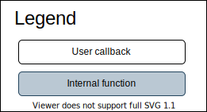
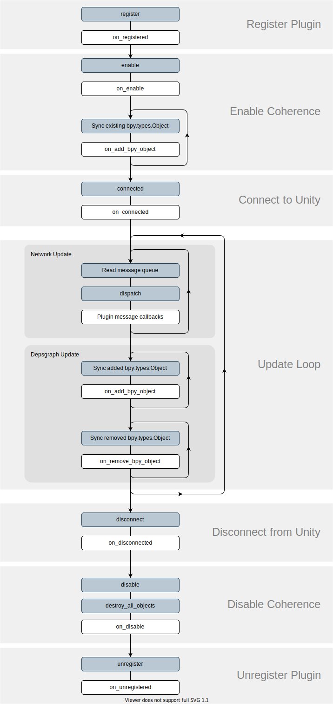

Component Lifecycle
-------------------------

The below is a diagram of events that occur throughout the Component's lifecycle for both Unity and Blender.

Snake-case user callbacks in Blender match with PascalCase callbacks in Unity. For example, :py:meth:`.Component.on_enable` is equivalent to :sphinxsharp:meth:`IComponent.OnEnable`.

