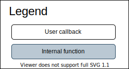
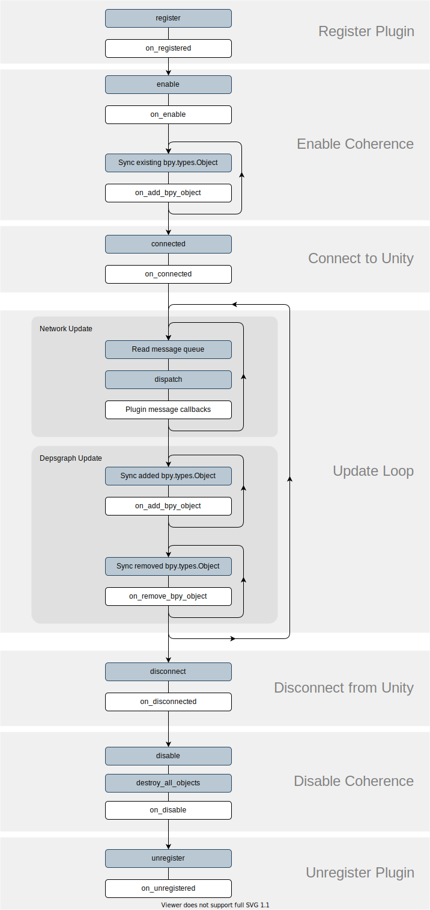

Global Plugin Lifecycle
-------------------------

Global Plugins are created through :meth:`register_plugin` and are destroyed on :meth:`unregister_plugin`.

The below is a diagram of events that occur throughout the Global Plugin's lifecycle for both Unity and Blender.

