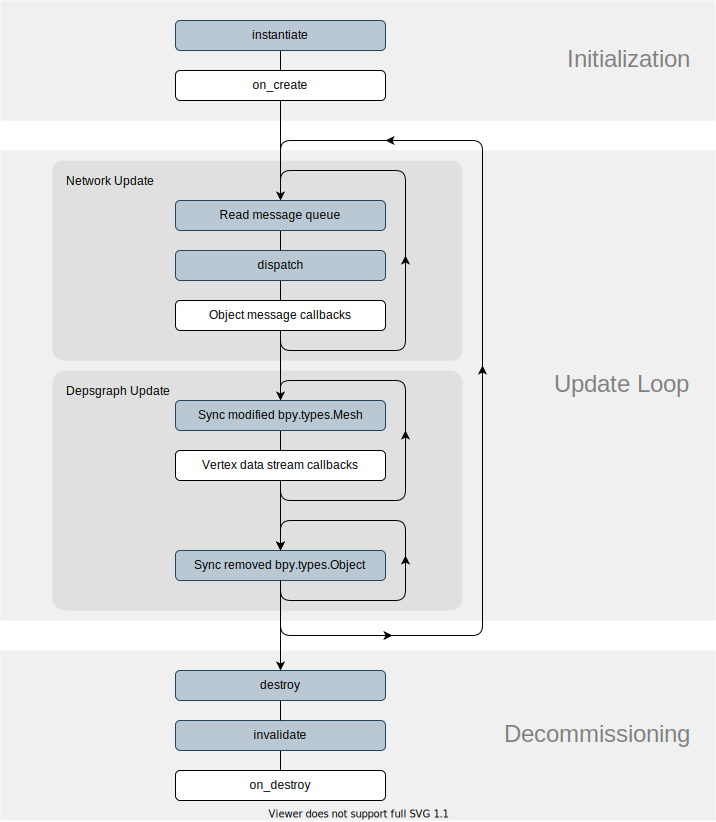

Object Plugin Lifecycle
-------------------------

Object Plugins are created through :meth:`.Plugin.instantiate` and are destroyed when their parent Global Plugin is removed or the associated :class:`bpy.types.Object` is removed from the scene.

The below is a diagram of events that occur throughout the Object Plugin's lifecycle for both Unity and Blender.

.. image:: ../diagrams/legend.svg

